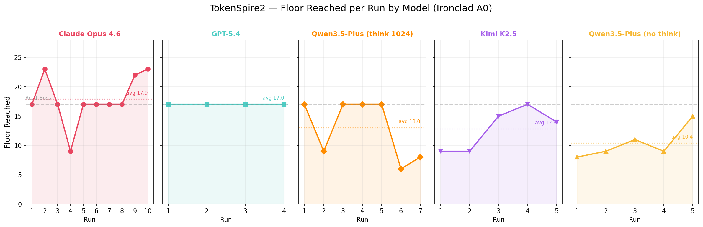

[English](README_en.md) | [中文](README.md)

# TokenSpire2 — LLM-Powered Slay the Spire 2 Agent

An autonomous Slay the Spire 2 mod that plays through entire runs using LLM-powered decision making. The agent handles all game phases — combat, map navigation, events, shops, rewards, and rest sites — by serializing game state into text prompts and parsing LLM responses into game actions.

## How It Works

1. **Game state serialization** — Each decision point (combat turn, map choice, event, shop, etc.) is converted into a structured text description including HP, energy, hand, enemies, relics, potions, and available options.
2. **LLM decision** — The serialized state is sent to an OpenRouter-compatible API. The LLM responds with structured commands (`PLAY 3 -> A`, `CHOOSE 2`, `BUY 5`, etc.).
3. **Action execution** — Responses are parsed and executed as game actions (playing cards, using potions, selecting map nodes, buying items, etc.).
4. **Continual learning** — After each run, the LLM reflects on its performance and updates a memory file that persists across runs within a session, enabling it to learn from mistakes.

## Features

- **Full autoplay** — Handles every game phase: combat, map, events, shops, rewards, rest sites, card selection, game over
- **Auto-restart** — Automatically starts new runs from the main menu after game over
- **LLM integration** — OpenRouter API with SSE streaming (non-blocking), reasoning/thinking support for Claude, GPT o-series, DeepSeek, and others
- **Continual learning** — Per-session memory system where the LLM maintains and updates its own strategy notes across runs
- **Conversation history** — Full conversation logs saved as JSON for analysis
- **Fallback mode** — Works without LLM config using random decisions
- **Bilingual prompts** — System prompt and game state descriptions in both English and Chinese

## Performance



### Multi-Model Comparison (Ironclad A0)

| Model | Runs | Avg Floor | Best Floor | Past Act 1 Boss |
|-------|------|-----------|------------|-----------------|
| Claude Opus 4.6 | 10 | 17.2 | 23 | 3/10 |
| GPT-5.4 | 4 | 17.0 | 17 | 0/4 |
| Qwen3.5-Plus (think 1024) | 7 | 13.0 | 17 | 0/7 |
| Kimi K2.5 | 5 | 12.8 | 17 | 0/5 |
| Qwen3.5-Plus (no think) | 5 | 10.4 | 15 | 0/5 |

- **Claude Opus 4.6** performed best — 3 out of 10 runs broke past the Act 1 Boss into Act 2 (reaching floor 23), with an upward trend in later runs
- **GPT-5.4** consistently reached the Act 1 Boss (floor 17) but failed to defeat it in all 4 runs
- **Qwen3.5-Plus (think 1024)** significantly improved with thinking enabled — 4 out of 7 runs reached the Boss, though performance was inconsistent in later runs
- **Kimi K2.5** performed similarly to Qwen with thinking, reaching the Boss once
- **Qwen3.5-Plus (no think)** averaged around floor 10 — thinking capability had a clear positive impact on performance

### Claude Opus 4.6 — First Session (4 Runs, Ironclad A0)

Model: `anthropic/claude-opus-4.6` via OpenRouter with extended thinking enabled.

| Run | Floor | Result | Killed By | Run Time | Deck Size |
|-----|-------|--------|-----------|----------|-----------|
| 1 | 9 | Defeat | Sewer Clam | 14:36 | 13 cards |
| 2 | 9 | Defeat | Terror Eel (Elite) | 19:14 | 15 cards |
| 3 | 9 | Defeat | Terror Eel (Elite) | 21:32 | 15 cards |
| 4 | 17 | Defeat | Waterfall Giant (Boss) | 23:58 | 16 cards |

**Observations:**
- Clear improvement across runs — Run 4 reached the Act 1 boss (floor 17) after three floor-9 deaths
- The LLM's continual learning memory correctly identified its key weakness: **lack of Strength scaling** — all 4 runs had zero permanent Strength sources, making boss fights mathematically unwinnable
- Good strategic reasoning: learned to avoid elites at low HP, prioritize card removal, and evaluate card synergies
- Identified enemy patterns (Corpse Slug chain-kill mechanic, Terror Eel stun threshold, Waterfall Giant damage escalation)
- Potion usage had bugs in early runs (now fixed) — the agent noted this in its memory and adapted
- Run time increased as the LLM maintained longer conversations and deeper reasoning

**LLM Memory Highlights (after 4 runs):**
- Correctly identified Strength scaling as the #1 priority for Ironclad
- Built a detailed enemy knowledge base from experience
- Developed a card tier list (S: Shrug It Off, Pommel Strike, Battle Trance, Whirlwind)
- Learned pathing strategies (avoid Elites below 60% HP, Shop → Rest → Boss)
- Set specific rules (e.g., "stop rerolling events after 12 HP spent")

## Setup

### Prerequisites

- **Slay the Spire 2** (v0.98+) installed via Steam

### Option 1: Download Release (Recommended)

1. Download the latest `TokenSpire2-vX.X.X.zip` from [Releases](https://github.com/collinzrj/TokenSpire2/releases)
2. Extract the zip into your mods folder:
   - **Windows:** `<Steam>/steamapps/common/Slay the Spire 2/mods/`
   - **macOS:** `~/Library/Application Support/Steam/steamapps/common/Slay the Spire 2/mods/`
3. You should end up with a `TokenSpire2/` folder inside `mods/`
4. Edit `llm_config.json` inside the `TokenSpire2/` folder — fill in your API key
5. In Steam, right-click Slay the Spire 2 → Properties → Launch Options, add `--autoslay`
6. Launch the game

### Option 2: Build from Source

Requires **.NET 9 SDK** — https://dotnet.microsoft.com/download/dotnet/9.0

```bash
dotnet build
```

The build automatically copies `TokenSpire2.dll` to your mods folder:

**Windows:**
```
<Steam>/steamapps/common/Slay the Spire 2/mods/TokenSpire2/
```

**macOS:**
```
~/Library/Application Support/Steam/steamapps/common/Slay the Spire 2/mods/TokenSpire2/
```

Game data directory on macOS (used for DLL references):
```
~/Library/Application Support/Steam/steamapps/common/Slay the Spire 2/SlayTheSpire2.app/Contents/Resources/data_sts2_macos_arm64/
```

### LLM Configuration

Edit `llm_config.json` in the mod folder (next to `TokenSpire2.dll`):

```json
{
  "Url": "https://openrouter.ai/api/v1",
  "Key": "sk-or-v1-your-key-here",
  "Model": "anthropic/claude-opus-4.6",
  "Lang": "zh"
}
```

| Field | Description |
|-------|-------------|
| `Url` | OpenRouter (or any OpenAI-compatible) API endpoint |
| `Key` | API key |
| `Model` | Model identifier (e.g., `anthropic/claude-opus-4.6`, `deepseek/deepseek-r1`, `openai/o3`) |
| `Lang` | Prompt language: `zh` (Chinese) or `en` (English) |

Without this file, the mod falls back to random decisions.

### Reasoning Support

The mod automatically configures reasoning/thinking parameters based on the model:
- **Claude**: `reasoning: { max_tokens: 2048 }` + Anthropic provider routing
- **OpenAI o-series**: `reasoning: { effort: "high" }`
- **DeepSeek/Qwen/GLM/Kimi/MiniMax**: Built-in thinking, no extra params needed

## Project Structure

```
sts2_mod/
├── MainFile.cs                 Mod entry point (Harmony patches + AutoSlay node)
├── TokenSpire2.csproj              Build configuration
├── TokenSpire2.json                Mod manifest
├── src/
│   ├── AutoSlayNode.cs         Main game loop — state detection, LLM orchestration
│   ├── AutoSlayCardSelector.cs Mid-combat card selection (ICardSelector)
│   ├── AutoSlayHelpers.cs      Scene tree traversal utilities
│   ├── AutoSlayPatch.cs        Harmony patches
│   ├── Handlers/               Per-screen action handlers
│   │   ├── CombatHandler.cs    Random combat fallback
│   │   ├── PotionHelper.cs     Potion target resolution
│   │   ├── MapHandler.cs       Map navigation
│   │   ├── GameOverHandler.cs  Game over screen automation
│   │   ├── ShopHandler.cs      Shop purchasing
│   │   └── ...                 (events, rewards, rest sites, etc.)
│   └── Llm/                    LLM integration layer
│       ├── LlmClient.cs        API client (streaming, memory, history)
│       ├── LlmConfig.cs        Config file loader
│       ├── GameStateSerializer.cs  Game state → text prompt conversion
│       ├── PromptStrings.cs    Bilingual prompt templates
│       └── RunSummaryLogger.cs Run statistics tracking
└── gameplay_log/               Saved gameplay logs for analysis
```

## Output Files

The mod writes these files next to `TokenSpire2.dll` (all sharing the same session timestamp):

| File | Content |
|------|---------|
| `llm_log_{ts}.txt` | Full conversation log with thinking/reasoning |
| `llm_log_{ts}.json` | Run summary statistics (JSON array, one entry per run) |
| `llm_history_{ts}.json` | Complete conversation history (nested array: runs → messages) |
| `llm_memory_{ts}.md` | LLM's self-maintained memory/strategy notes |

## Acknowledgments

- Built with reference to the [STS2 modding framework](https://github.com/erasels/Minty-Spire-2) by erasels
- Game: [Slay the Spire 2](https://store.steampowered.com/app/2868840/Slay_the_Spire_2/) by Mega Crit
